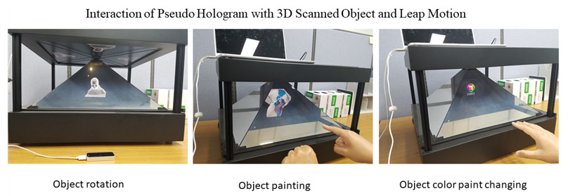

# PseudoHologram-Leap
The Interactive Pseudo Hologram with 3D Scanned Object and Leap Motion

#MainFunctions

An interactive pseudo hologram with 3D scanned object is an application provided the interaction between the user and 3D scanned object by using Leap Motion sensor device. This application contains three main functionalities which are:
1. Reconstructing the 3D object which is captured from the real object by using 3D scanner
2. Integrating of web application and pyramid pseudo holographic projector for providing the 3D scanned visualization
3. Providing interaction between the user and the 3D scanned object by using Leap Motion sensor which included several features such as:
- Rotate: the user can rotate the 3D scanned object by using 2 fingers)
- Zoom-in/Zoom-out: the user can use 5 fingers for zooming-in and zooming-out the object
-  Point: the 3D scanned object can be pointed with 6 finger (finger release and finger point)
-  Paint: it allows the user to paint the 3D scanned object with real color by using grabbed finger and point finger. The user can also resize the brush of object painting.

#References
- <a href="http://www.seedoubleyou.nl/blog/leap-mesh-painter-demo/item36"> Leap Mesh Painter Demo </a>
- <a href="http://www.instructables.com/id/Reflective-Prism/">REFLECTIVE PRISM</a>
